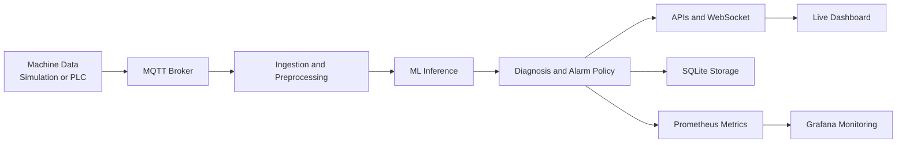
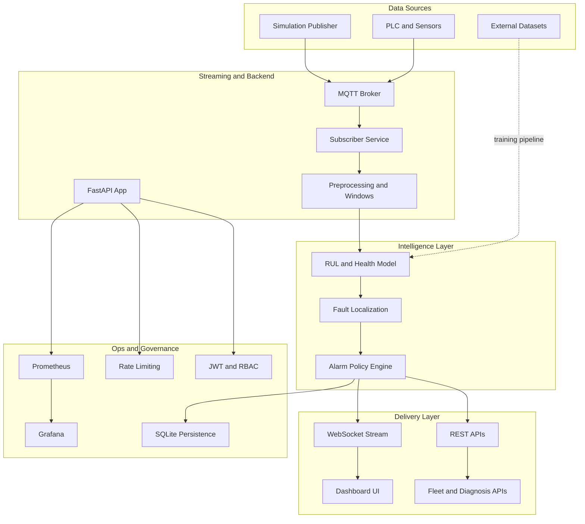
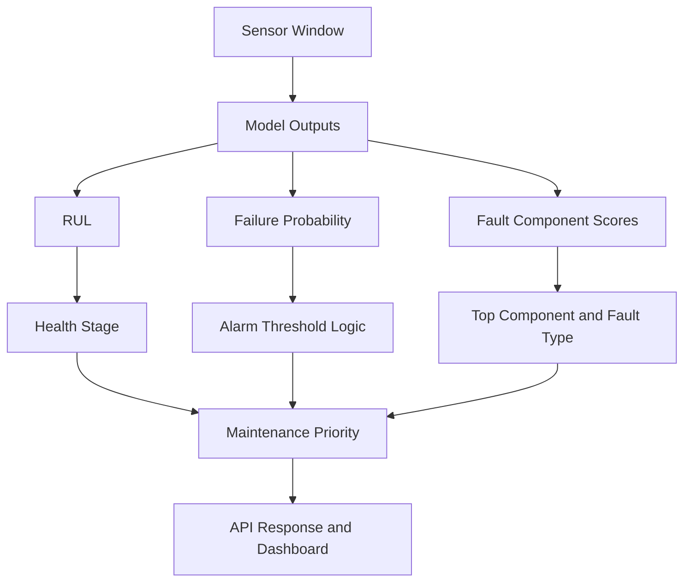
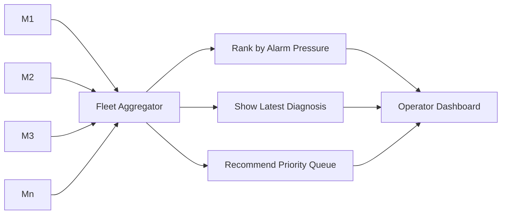
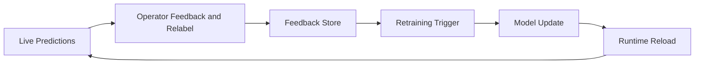

# Slide-Ready System Diagrams

This file contains presentation-friendly Mermaid diagrams with short labels and clean flow for PPT/defense usage.

## Slide 1: End-to-End Block Diagram

Speaker cue:
- "Data comes in, model predicts, diagnosis decides urgency, and results are shown live with full monitoring."

## Slide 2: Layered System Architecture

Speaker cue:
- "The system is layered from data to intelligence to delivery, with security and observability as first-class concerns."

## Slide 3: Model and Decision Flow

Speaker cue:
- "We combine predictive outputs with policy logic to produce operational decisions, not just model scores."

## Slide 4: Fleet Monitoring Flow

Speaker cue:
- "Fleet mode helps teams decide which machine to inspect first based on risk and urgency."

## Slide 5: Continuous Improvement Loop

Speaker cue:
- "The system learns from real operator feedback, enabling continuous improvement over time."

## Fast PPT Usage Tips

- Use one diagram per slide.
- Keep animation simple: reveal left to right.
- Add one sentence under each diagram explaining value.
- End with Slide 5 to show this is a living system, not a static model.
