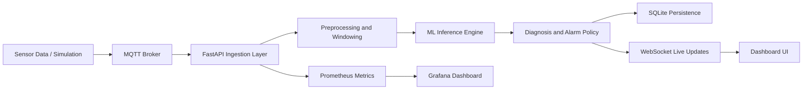
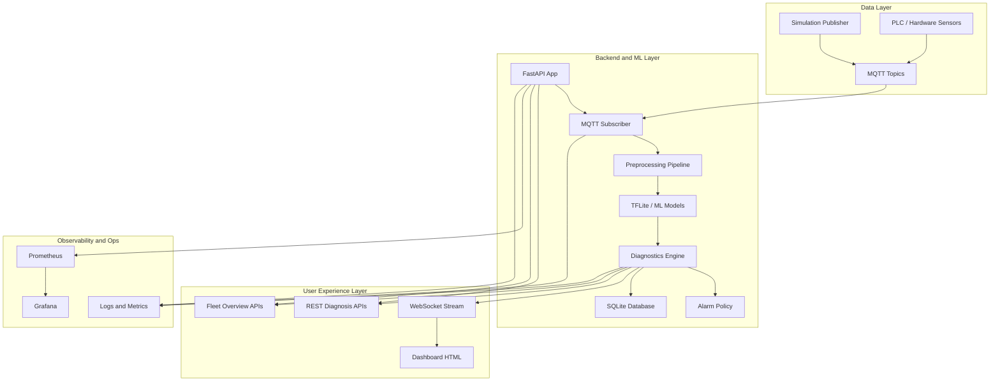

# System Diagrams

## 1) High-Level Block Diagram



## 2) System Architecture Diagram



## 3) How To Read the Diagrams

- The block diagram shows the main data flow from telemetry to dashboard.
- The architecture diagram shows how the system is split into data, backend, user experience, and observability layers.
- Both diagrams reflect the current implemented system and the next-step hardware path.

## 4) Teacher-Friendly Summary

If asked to explain the architecture in one sentence, say:

"Sensor data enters through MQTT or simulation, gets preprocessed and scored by the ML backend, is turned into diagnosis and alarm outputs, then is exposed through APIs, a live dashboard, and observability tools."
```